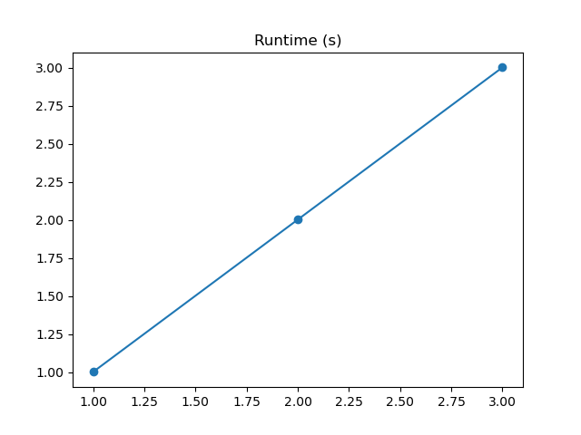
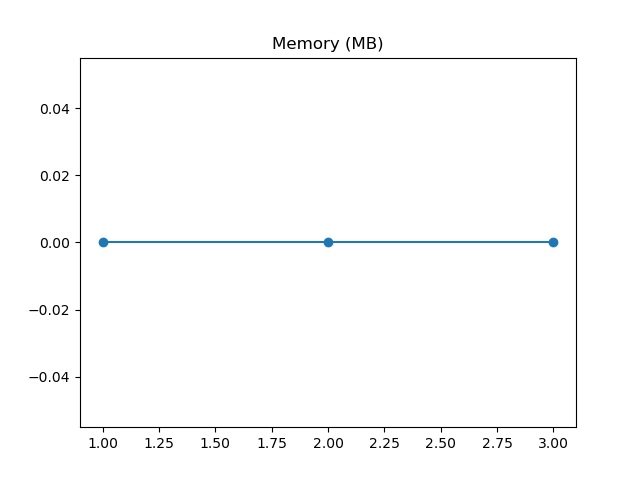

# Hydra Slurm example

This is an example of how to use Hydra to launch jobs locally and on a Slurm cluster. For more background, read https://hydra.cc/docs/plugins/submitit_launcher/. This is an extended example of https://github.com/facebookresearch/hydra/tree/main/plugins/hydra_submitit_launcher/example.

The application in `my_app.py` is a Python script that prints the process and task ID. The task is sleeping for a number of seconds, the amount of seconds is defined by the task id. The application is launched with Hydra, which reads in the config files in `configs/` and allows overriding various aspects of the execution.

## Local setup

Install conda and create a new environment:

```bash
conda env update -f env.yaml --prune
```

## HPC setup

Depending on the infrastructure and cluster, you maybe need to change some modules
```
module swap cluster/slaking
source modules.sh
```

You can always reset this setup using `module purge`.

## Different launch options

### Run locally one task

Note that by default Hydra stores the configuration, logs and output of each run in a unique folder `outputs/{DAY}/{TIME}/`. The output folder contains a `my_app.log` file and a `.hydra/` folder specifying the complete configuration used for the run.

```bash
python my_app.py
```
OUTPUT:
```
Output directory : /kyukon/data/gent/vo/000/gvo00070/vsc43257/hydra_hpc_example/outputs/2023-03-22/18-32-48
[2023-03-22 18:32:50,328][__main__][INFO] - Process ID 613656 executed task 1 in 1.0050375601276755 seconds
```

### Run locally multiple tasks sequentially

Note that the multiple runs now each have an output folder in `multirun/{DAY}/{TIME}/`. All process IDs are the same, as the tasks run sequentially in the same process.

```bash
python my_app.py task=1,2,3 -m
```
OUTPUT:
```
[2023-03-22 18:33:45,804][HYDRA] Launching 3 jobs locally
[2023-03-22 18:33:45,804][HYDRA]        #0 : task=1
Output directory : /kyukon/data/gent/vo/000/gvo00070/vsc43257/hydra_hpc_example/multirun/2023-03-22/18-33-45/0
[2023-03-22 18:33:47,122][__main__][INFO] - Process ID 614183 executed task 1 in 1.005050259642303 seconds
[2023-03-22 18:33:47,127][HYDRA]        #1 : task=2
Output directory : /kyukon/data/gent/vo/000/gvo00070/vsc43257/hydra_hpc_example/multirun/2023-03-22/18-33-45/1
[2023-03-22 18:33:49,269][__main__][INFO] - Process ID 614183 executed task 2 in 2.008807019330561 seconds
[2023-03-22 18:33:49,271][HYDRA]        #2 : task=3
Output directory : /kyukon/data/gent/vo/000/gvo00070/vsc43257/hydra_hpc_example/multirun/2023-03-22/18-33-45/2
[2023-03-22 18:33:52,400][__main__][INFO] - Process ID 614183 executed task 3 in 3.0123810535296798 seconds
```

### Run locally multiple tasks in parallel

Note that all process IDs are the different, as each tasks runs in it's own process.

```bash
python my_app.py task=1,2,3 hydra/launcher=joblib -m
```
OUTPUT:
```
[2023-03-22 18:34:21,910][HYDRA] Joblib.Parallel(n_jobs=-1,backend=loky,prefer=processes,require=None,verbose=0,timeout=None,pre_dispatch=2*n_jobs,batch_size=auto,temp_folder=None,max_nbytes=None,mmap_mode=r) is launching 3 jobs
[2023-03-22 18:34:21,910][HYDRA] Launching jobs, sweep output dir : multirun/2023-03-22/18-34-17
[2023-03-22 18:34:21,910][HYDRA]        #0 : task=1
[2023-03-22 18:34:21,910][HYDRA]        #1 : task=2
[2023-03-22 18:34:21,910][HYDRA]        #2 : task=3
Output directory : /kyukon/data/gent/vo/000/gvo00070/vsc43257/hydra_hpc_example/multirun/2023-03-22/18-34-17/1
Output directory : /kyukon/data/gent/vo/000/gvo00070/vsc43257/hydra_hpc_example/multirun/2023-03-22/18-34-17/0
Output directory : /kyukon/data/gent/vo/000/gvo00070/vsc43257/hydra_hpc_example/multirun/2023-03-22/18-34-17/2
[2023-03-22 18:34:24,018][__main__][INFO] - Process ID 614587 executed task 1 in 1.0050190892070532 seconds
[2023-03-22 18:34:25,018][__main__][INFO] - Process ID 614585 executed task 2 in 2.0100301038473845 seconds
[2023-03-22 18:34:26,039][__main__][INFO] - Process ID 614590 executed task 3 in 3.015030917711556 seconds
```

### Run on Slurm with the local test config

Note that by default no logging and print statements are shown, these are stored at `.submitit/` in the output directory next to the output of each run. [`submitit_local`](https://github.com/facebookincubator/submitit/blob/4cf1462d7216f9dcc530daeb703ce07c37cf9d72/submitit/local/local.py#LL99) uses `subprocess` to run the tasks locally, so the functionality and output is similar to joblib.

```bash
python my_app.py task=1,2,3 hydra/launcher=submitit_local -m
```
OUTPUT:
```
[2023-03-22 18:34:39,453][HYDRA] Submitit 'local' sweep output dir : multirun/2023-03-22/18-34-38
[2023-03-22 18:34:39,455][HYDRA]        #0 : task=1
[2023-03-22 18:34:39,461][HYDRA]        #1 : task=2
[2023-03-22 18:34:39,469][HYDRA]        #2 : task=3
```
### Run on Slurm using the HPC job scheduler

Can only be executed on the HPC cluster.

```bash
python my_app.py task=1,2,3 hydra/launcher=submitit_slurm -m
```
OUTPUT:
```
[2023-03-22 18:35:05,317][HYDRA] Submitit 'slurm' sweep output dir : multirun/2023-03-22/18-35-04
[2023-03-22 18:35:05,318][HYDRA]        #0 : task=1
[2023-03-22 18:35:05,326][HYDRA]        #1 : task=2
[2023-03-22 18:35:05,334][HYDRA]        #2 : task=3
```

## Specifying resources

For a full list of settings, see the HPC documentation. To see available parameters, run:
```
python my_app.py hydra/launcher=submitit_slurm --cfg hydra -p hydra.launcher
```

Slurm job with 2 CPUs and 4GB of RAM:
```
python my_app.py hydra/launcher=submitit_slurm hydra.launcher.cpus_per_task=2 hydra.launcher.mem_gb=4GB
```

## Postprocess

Because the multirun output folder has a fixed structure, you can easily parse the folder with a script and plot some metrics. This example script creates plots in the multirun folder when executing the script with a benchmark option.
```
python my_app.py task=1,2,3 benchmark=runtime hydra/launcher=submitit_slurm -m
python script/plots.py
```

Note that the configuration `task=1,2,3 benchmark=runtime,memory` will require 6 tasks and fail on an interactive cluster with a 5 task queue limit.

The runtime plot shows the 3 tasks with increasing sleep length.


The memory plot shows constant memory consumption in all three tasks.


The postprocessing script can be extended to any kind of analysis on a completed multirun folder.

## Common patterns

There are various usage patterns in Hydra to make your life easier. For more information, see the [Hydra documentation](https://hydra.cc/docs/patterns/configuring_experiments/).

## Possible improvements

- More complex tasks
- Nicer plots
- Hydra Structured configs instead of YAML files
- Allow benchmarking using platform instrumentation and diagnostics ([Slurm](https://saeyslab.github.io/dambi-hpc-guide/advanced/benchmarking.html), [Dask](https://docs.dask.org/en/stable/diagnostics-local.html), Prefect...)
- More complex Hydra config
- Optuna sweeper
- Usage with Dask
- Usage with Prefect 