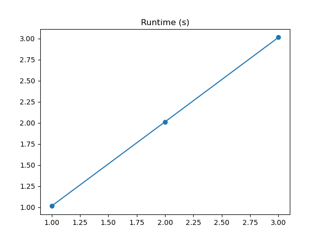
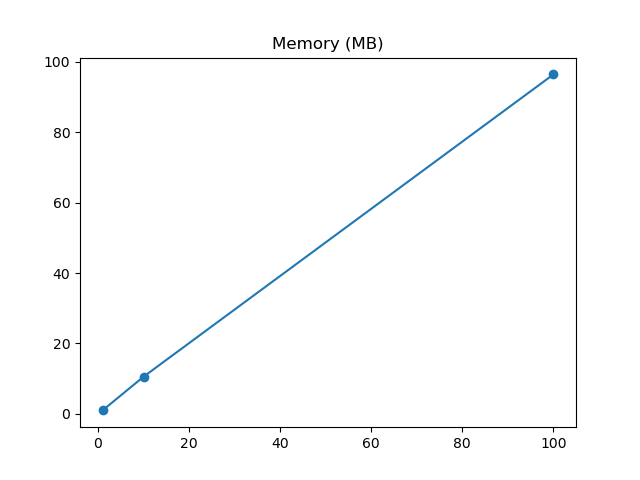

# Launch jobs using Dask and dask_jobqueue

This example implements a task that sleeps for `{runtime}` seconds and holds a Numpy array of `{memory}` megabytes in size. The runtime can be measured with `timeit` and the memory usage with `memray`. It runs using Dask, a distributed computing framework, and dask_jobqueue, a library to launch jobs on HPC clusters.

The main function is Python process that executes the Dask scheduler, managing the owrkers. The workers are launched using the `dask_jobqueue` library, which submits jobs to the HPC cluster. It is important that the scheduler does not run on the login node and uses the same HPC modules environment as the workers. You can the HPC scheduler (PBS or SLURM) to submit this Python script from the login node or launch it from an interactive session. Here a different approach is used. A conda environment similar to the modules environment is used, which can create a similar environment on a local laptop and on the HPC login node. This environment can be used in VS Code for debugging and on the HPC cluster for launching the scheduler and workers. Actually running the tasks is done by the schedulers and workers, using the modules environment.

## Installation

(1) Locally on a laptop or (2) the HPC login node
```bash
conda env update -f src/dask_jobqueue/env.yaml
conda activate dask_jobqueue
pip install -r src/dask_jobqueue/requirements.txt
```

(3) installing the modules environment for a specific HPC cluster
```bash
ml swap cluster/donphan
INSTALL=src/dask_jobqueue srun --pty runner.pbs
```

To test out the worker environment, start an interactive session on the HPC cluster
```bash
qsub -I # not needed if using session via the Open OnDemand portal
ACTIVATE=src/dask_jobqueue source runner.pbs
cd $PBS_O_WORKDIR
```

All three of these seperate cases should be able to run:
```bash
python src/dask_jobqueue/main.py --help
```

## Basic run

Without extra options, the following command will run locally and execute one task with a runtime of 1 second and a memory usage of 10 megabytes.


```bash
python src/dask_jobqueue/main.py
```
OUTPUT:
```log
(dask_jobqueue) [vsc43257@gligar07 hydra_hpc_example]$ python src/dask_jobqueue/main.py 
Output directory: /kyukon/data/gent/vo/000/gvo00070/vsc43257/hydra_hpc_example/outputs/2024-01-04/13-59-46
Path venv: /data/gent/432/vsc43257/venvs//venv_dask_jobqueue_doduo
Path modules: /kyukon/data/gent/vo/000/gvo00070/vsc43257/hydra_hpc_example/src/dask_jobqueue
[2024-01-04 13:59:49,837][__main__][INFO] - Process ID 248241 executed task {'runtime': 1, 'memory': 10} in 1.0149385700933635 seconds
```

In the folder `outputs/` you can find the output of the run by date and time. The output folder contains a `.hydra/` folder specifying the complete configuration used for the run and any output file written to `cfg.output_dir`.

To run on the HPC cluster, we need to launch job workers not locally, but on a cluster worker node using `dask_jobqueue`. For this we can use the `cluster=slurm` argument, which will use the Dask cluster defined at `configs/cluster/slurm.yaml`. This will not work if there is an environment mismatch between the scheduler (conda environment) and the workers (modules environment).

```bash
python src/dask_jobqueue/main.py cluster=slurm
```

It is possible to also run on the very limited login node by using the conda environment also at the workers with cluster=slurm_conda, but it is highly recommended to submit jobs the debug cluster instead.

```bash
ml swap cluster/donphan
python src/dask_jobqueue/main.py cluster=slurm launcher=submitit_slurm -m
```

## Launching large jobs

After testing and debugging, large jobs can be launched using two methods, the runner script or submitit.

The runner script does not need a conda environment to launch and is most similar to PBS or SLURM scripts.
```
ACTIVATE=src/sleep_pbs script=src/dask_jobqueue/main.py sbatch runner.pbs --help
```

The Hydra Launcher plugin approach requires a conda environment to launch, but is more integrated with the Hydra CLI and other plugins. Note the need for the multirun flag `-m`. The options for `hydra/launcher` are built-in by installing the Launcher plugins, but `launcher=submitit_slurm` is a config located at `configs/launcher/submitit_slurm`. The output of multirun jobs are in the folder `multiruns`, not `outputs`.

```bash
# test launch on login node via joblib and conda env
python src/dask_jobqueue/main.py cluster=slurm_conda hydra/launcher=joblib -m
# test launch on login node via submitit_local and conda env
python src/dask_jobqueue/main.py cluster=slurm_conda hydra/launcher=submitit_local -m
# launch on HPC cluster via submitit_slurm and modules env
python src/dask_jobqueue/main.py cluster=slurm launcher=submitit_slurm -m
```

TODO currently submitit_launcher does not work, as submitit_slurm uses the current executor sys.executable, which is the conda env python, not the modules env python. Fix PR at https://github.com/facebookresearch/hydra/pull/2830.

## Multirun

Because the multirun output folder has a fixed structure, you can parse the folder with a script and plot the benchmarking metrics. This example script creates plots in the multirun folder when executing the script with a benchmark option.
```bash
ml swap cluster/donphan
# launch interactive session
# ACTIVATE=src/dask_jobqueue script=bash srun --pty runner.pbs
# execute the multi-run
python src/dask_jobqueue/main.py +sweep='{runtime: 1, memory: 1},{runtime: 2, memory: 10},{runtime: 3, memory: 100}' task.runtime='${sweep.runtime}' task.memory='${sweep.memory}' benchmark=all hydra/launcher=joblib -m
python scripts/sleep_plots.py
```

Note that the configuration `task.sleep=1,2,3 benchmark=runtime,memory` would require 6 tasks and fail on an interactive cluster with a 5 task queue limit.

The runtime plot shows the 3 tasks with increasing sleep length.


The memory plot shows the 3 tasks with increasing memory usage.


## Different launch options explained

### Run locally one task

Note that by default Hydra stores the configuration, logs and output of each run in a unique folder `outputs/{DAY}/{TIME}/`. The output folder contains a `.hydra/` folder specifying the complete configuration used for the run and any output file written to `cfg.output_dir`.

```bash
python src/sleep_hydra/main.py
```
OUTPUT:
```log
Output directory : /kyukon/data/gent/vo/000/gvo00070/vsc43257/hydra_hpc_example/outputs/2023-10-20/11-09-33
[2023-10-20 11:09:34,986][__main__][INFO] - Process ID 1595501 executed task {'runtime': 1, 'memory': 10} in 1.000080016994616 seconds
```

### Run locally multiple tasks sequentially

Note that the multiple runs now each have an output folder in `multirun/{DAY}/{TIME}/`. All process IDs are the same, as the tasks run sequentially in the same process.

```bash
python src/sleep_hydra/main.py task.runtime=1,2,3 -m
```
OUTPUT:
```log
[2023-10-20 11:10:43,219][HYDRA] Launching 3 jobs locally
[2023-10-20 11:10:43,219][HYDRA]        #0 : task.runtime=1
Output directory : /kyukon/data/gent/vo/000/gvo00070/vsc43257/hydra_hpc_example/multirun/2023-10-20/11-10-42/0
[2023-10-20 11:10:44,407][__main__][INFO] - Process ID 1597253 executed task {'runtime': 1, 'memory': 10} in 1.0000840639986563 seconds
[2023-10-20 11:10:44,411][HYDRA]        #1 : task.runtime=2
Output directory : /kyukon/data/gent/vo/000/gvo00070/vsc43257/hydra_hpc_example/multirun/2023-10-20/11-10-42/1
[2023-10-20 11:10:46,501][__main__][INFO] - Process ID 1597253 executed task {'runtime': 2, 'memory': 10} in 2.0000894780096132 seconds
[2023-10-20 11:10:46,503][HYDRA]        #2 : task.runtime=3
Output directory : /kyukon/data/gent/vo/000/gvo00070/vsc43257/hydra_hpc_example/multirun/2023-10-20/11-10-42/2
[2023-10-20 11:10:49,586][__main__][INFO] - Process ID 1597253 executed task {'runtime': 3, 'memory': 10} in 3.0000770180195104 seconds
```

### Run locally multiple tasks in parallel

Note that all process IDs are the different, as each tasks runs in it's own process.

```bash
python src/sleep_hydra/main.py task.runtime=1,2,3 hydra/launcher=joblib -m
```
OUTPUT:
```log
[2023-10-20 11:12:03,084][HYDRA] Joblib.Parallel(n_jobs=-1,backend=loky,prefer=processes,require=None,verbose=0,timeout=None,pre_dispatch=2*n_jobs,batch_size=auto,temp_folder=None,max_nbytes=None,mmap_mode=r) is launching 3 jobs
[2023-10-20 11:12:03,084][HYDRA] Launching jobs, sweep output dir : multirun/2023-10-20/11-11-57
[2023-10-20 11:12:03,085][HYDRA]        #0 : task.runtime=1
[2023-10-20 11:12:03,085][HYDRA]        #1 : task.runtime=2
[2023-10-20 11:12:03,085][HYDRA]        #2 : task.runtime=3
Output directory : /kyukon/data/gent/vo/000/gvo00070/vsc43257/hydra_hpc_example/multirun/2023-10-20/11-11-57/0
Output directory : /kyukon/data/gent/vo/000/gvo00070/vsc43257/hydra_hpc_example/multirun/2023-10-20/11-11-57/1
Output directory : /kyukon/data/gent/vo/000/gvo00070/vsc43257/hydra_hpc_example/multirun/2023-10-20/11-11-57/2
[2023-10-20 11:12:04,881][__main__][INFO] - Process ID 1598945 executed task {'runtime': 1, 'memory': 10} in 1.0003418159903958 seconds
[2023-10-20 11:12:05,912][__main__][INFO] - Process ID 1598949 executed task {'runtime': 2, 'memory': 10} in 2.000080882018665 seconds
[2023-10-20 11:12:06,913][__main__][INFO] - Process ID 1598952 executed task {'runtime': 3, 'memory': 10} in 3.000079121993622 seconds
```

### Run on Slurm with the local test config

Note that by default no logging and print statements are shown, these are stored at `.submitit/` in the output directory next to the output of each run. [`submitit_local`](https://github.com/facebookincubator/submitit/blob/4cf1462d7216f9dcc530daeb703ce07c37cf9d72/submitit/local/local.py#LL99) uses `subprocess` to run the tasks locally, so the functionality and output is similar to joblib.

```bash
python src/sleep_hydra/main.py task.runtime=1,2,3 hydra/launcher=submitit_local -m
```
OUTPUT:
```log
[2023-10-20 11:12:57,639][HYDRA] Submitit 'local' sweep output dir : multirun/2023-10-20/11-12-57
[2023-10-20 11:12:57,641][HYDRA]        #0 : task.runtime=1
[2023-10-20 11:12:57,645][HYDRA]        #1 : task.runtime=2
[2023-10-20 11:12:57,653][HYDRA]        #2 : task.runtime=3
```
### Run on Slurm using the HPC job scheduler

Can only be executed on the HPC cluster.

```bash
python src/sleep_hydra/main.py task.runtime=1,2,3 hydra/launcher=submitit_slurm -m
```
OUTPUT:
```log
[2023-10-20 11:15:04,918][HYDRA] Submitit 'slurm' sweep output dir : multirun/2023-10-20/11-15-04
[2023-10-20 11:15:04,920][HYDRA]        #0 : task.runtime=1
[2023-10-20 11:15:04,924][HYDRA]        #1 : task.runtime=2
[2023-10-20 11:15:04,928][HYDRA]        #2 : task.runtime=3
```

## Specifying resources

For a full list of settings, see the HPC documentation. To see available parameters, run:
```bash
python src/sleep_hydra/main.py hydra/launcher=submitit_slurm --cfg hydra -p hydra.launcher
```

Slurm job with 2 CPUs and 4GB of RAM:
```bash
python src/sleep_hydra/main.py hydra/launcher=submitit_slurm hydra.launcher.cpus_per_task=2 hydra.launcher.mem_gb=4GB
```

## Benchmarking overhead

We can benchmark both runtime and memory in two ways besides `benchmark=runtime` and `benchmark=memory`:

`benchmark=all` will run the task twice, once with `timeit` and once with `memray`.
```bash
# seconds
[(3, 3.000507133983774), (2, 2.0004843850038014), (1, 1.0004661950224545)]
# megabytes
[(100, 95.39), (10, 9.559), (1, 0.999444)]
```

- `benchmark=hybrid` will run the task once with `timeit` inside the `memray` wrapper.
```bash
# seconds
[(3, 3.013979399984237), (2, 2.013261186017189), (1, 1.015038490993902)]
# megabytes
[(100, 96.392), (10, 10.561), (1, 1.001554)]
```

The overhead of `benchmark=hybrid` is negligable for large sizes, it's more important to run multiple times and report the variance. 