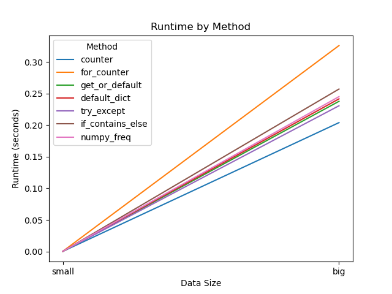

# Frequency example with Hydra

This example implements a task that counts the frequency of objects in a list. The runtime can be measured with `timeit` and the memory usage with `memray`.
The implementation is similar to other examples. The main difference is the use of hydra-zen so no YAML configuration or command line arguments are needed.

## Installation

- install conda

```bash
mamba env update -f src/frequencies_hydra/env.yaml
conda activate frequencies_hydra
pip install -e src/frequencies_hydra
```

- Select this conda environment in VS Code to use it for development

## Usage

You can run a multirun by executing the launch.py script:
```bash
python src/frequencies_hydra/src/frequencies_hydra/launch.py
```

The output will be stored in the `multirun` folder. Also a plot is created in the `resources` folder:


Like in other Hydra examples, you can also access a CLI by running the main.py script:
```bash
ml swap cluster/donphan
# launch interactive session
srun --pty bash
conda activate frequencies_hydra
# execute Hydra like normal
python src/frequencies_hydra/src/frequencies_hydra/main.py --help
```

You can also run jobs:
```bash
ACTIVATE=src/frequencies_hydra SCRIPT='python src/frequencies_hydra/src/frequencies_hydra/main.py --help' srun --pty runner.pbs
```
